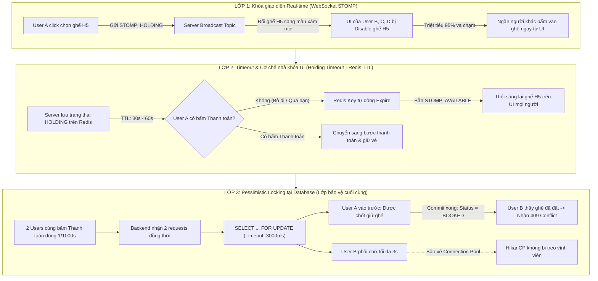
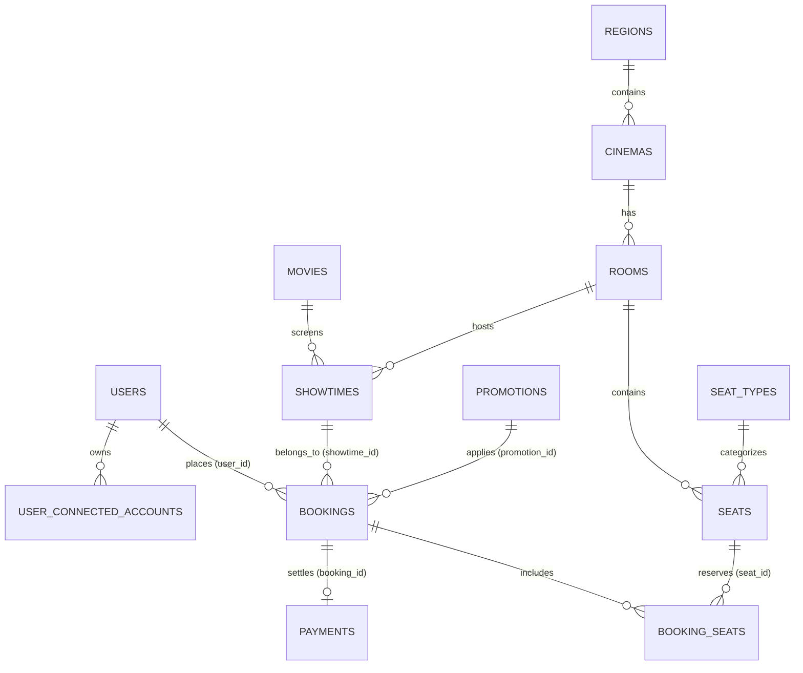
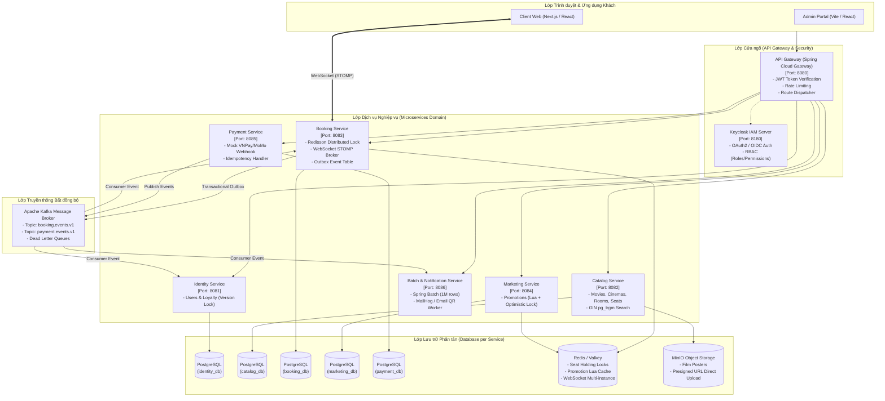
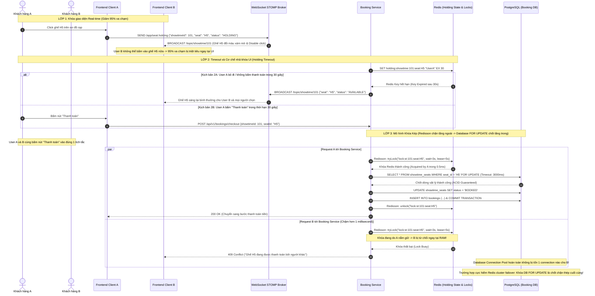
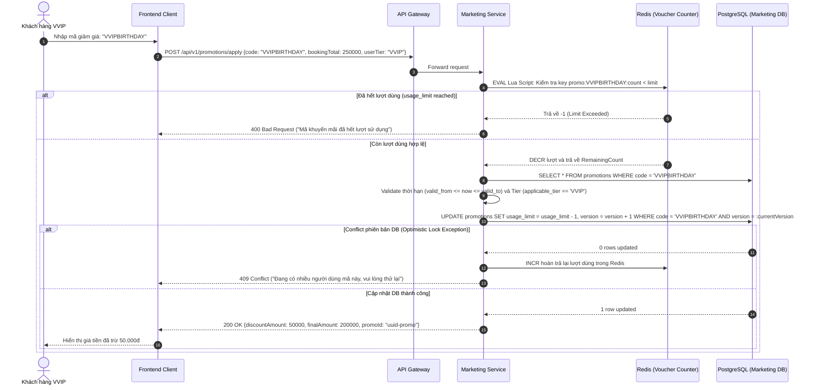
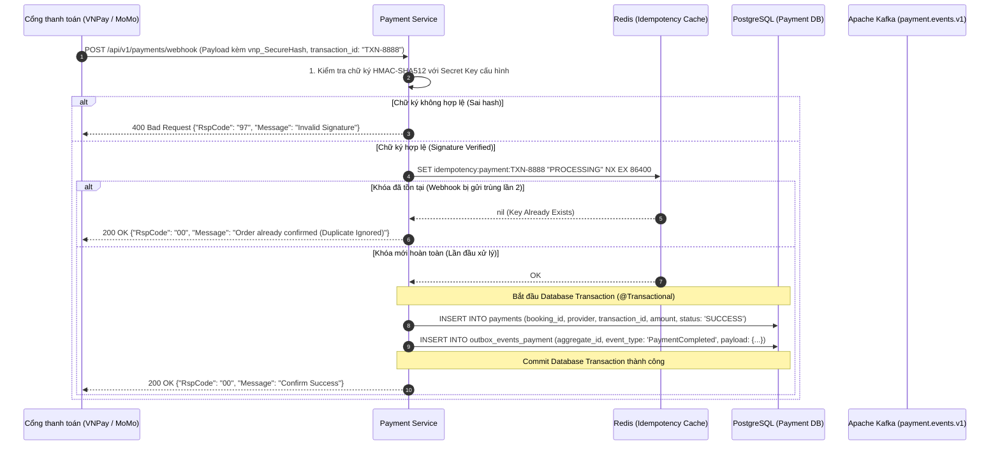
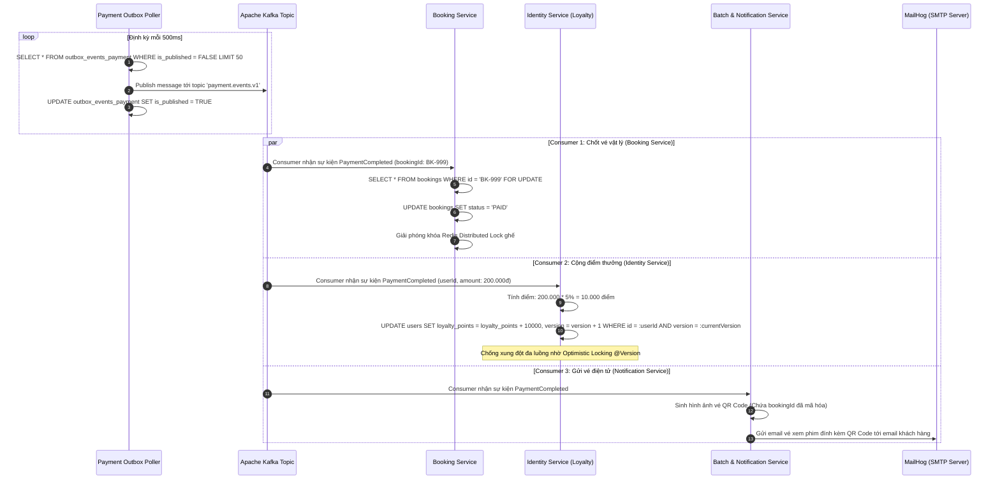

# 🎬 CineMatrix Enterprise — Microservices Movie Booking Platform
> **Đồ án môn học:** Các Công nghệ Lập trình Hiện đại (CCNLTHĐ - Niên khóa 09/2026)  
> **Tên đề tài:** Hệ thống Đặt vé xem phim Trực tuyến Phân tán theo Kiến trúc Microservices (Mô hình chuẩn chuỗi rạp CGV Cinemas)  
> **Mã định danh dự án:** `CGV-Enterprise-Booking`  
> **Đơn vị đào tạo:** Khoa Công nghệ Thông tin — Trường Đại học Sài Gòn (SGU)  

---

[](https://openjdk.org/)
[](https://spring.io/projects/spring-boot)
[](https://spring.io/projects/spring-cloud)
[](https://kafka.apache.org/)
[](https://www.postgresql.org/)
[](https://redis.io/)
[](https://www.keycloak.org/)
[](https://www.docker.com/)

---

## 📑 Mục lục
1. [Giới thiệu tổng quan & Bối cảnh bài toán](#1-giới-thiệu-tổng-quan--bối-cảnh-bài-toán)
2. [Ma trận Yêu cầu 3 Tầng Học thuật (Academic 3-Tier Framework)](#2-ma-trận-yêu-cầu-3-tầng-học-thuật-academic-3-tier-framework)
   - [Tầng 1: Bản chất công nghệ lõi (Spring Boot Framework)](#tầng-1-bản-chất-công-nghệ-lõi-spring-boot-framework)
   - [Tầng 2: Chuẩn Kỹ nghệ Phần mềm (Software Engineering Standards)](#tầng-2-chuẩn-kỹ-nghệ-phần-mềm-software-engineering-standards)
   - [Tầng 3: Kỹ thuật Nâng cao & Khác biệt chuyên sâu (Engineering Depth)](#tầng-3-kỹ-thuật-nâng-cao--khác-biệt-chuyên-sâu-engineering-depth)
3. [Thiết kế Cơ sở Dữ liệu Chi tiết (Database Architecture - DBML Standard)](#3-thiết-kế-cơ-sở-dữ-liệu-chi-tiết-database-architecture---dbml-standard)
4. [Phân rã chức năng theo vai trò người dùng (Role-Based Features Matrix)](#4-phân-rã-chức-năng-theo-vai-trò-người-dùng-role-based-features-matrix)
5. [Kiến trúc hệ thống & Sơ đồ Tuần tự Chi tiết (Architecture & Sequences)](#5-kiến-trúc-hệ-thống--sơ-đồ-tuần-tự-chi-tiết-architecture--sequences)
   - [5.1. Sơ đồ kiến trúc tổng thể (High-Level Architecture)](#51-sơ-đồ-kiến-trúc-tổng-thể-high-level-architecture)
   - [5.2. Sequence 1: Giữ ghế Real-time (WebSocket STOMP + Redis Distributed Lock)](#52-sequence-1-giữ-ghế-real-time-websocket-stomp--redis-distributed-lock)
   - [5.3. Sequence 2: Áp dụng Voucher Khuyến mãi (Redis Lua Script + Optimistic Locking)](#53-sequence-2-áp-dụng-voucher-khuyến-mãi-redis-lua-script--optimistic-locking)
   - [5.4. Sequence 3: Thanh toán Webhook (Idempotency Key + HMAC-SHA512 + Outbox Event)](#54-sequence-3-thanh-toán-webhook-idempotency-key--hmac-sha512--outbox-event)
   - [5.5. Sequence 4: Xử lý Kafka Event (Outbox Consumer, Optimistic Point, Mail QR)](#55-sequence-4-xử-lý-kafka-event-outbox-consumer-optimistic-point-mail-qr)
6. [Cấu trúc thư mục chuẩn Microservices (Project Directory Tree)](#6-cấu-trúc-thư-mục-chuẩn-microservices-project-directory-tree)
7. [Hướng dẫn cài đặt & Khởi chạy (Quickstart Guide)](#7-hướng-dẫn-cài-đặt--khởi-chạy-quickstart-guide)
8. [Quy chuẩn phát triển cho Developer (Engineering Guidelines)](#8-quy-chuẩn-phát-triển-cho-developer-engineering-guidelines)
9. [Bộ câu hỏi tự kiểm tra & Bảo vệ đồ án (Defense Self-Check)](#9-bộ-câu-hỏi-tự-kiểm-tra--bảo-vệ-đồ-án-defense-self-check)
10. [Minh bạch ứng dụng Trí tuệ nhân tạo (AI Disclosure)](#10-minh-bạch-ứng-dụng-trí-tuệ-nhân-tạo-ai-disclosure)

---

## 1. Giới thiệu tổng quan & Bối cảnh bài toán

### 1.1. Bối cảnh thực tế
Trong ngành dịch vụ chiếu phim hiện đại (mô hình chuẩn CGV Cinemas), thách thức kỹ thuật đỉnh điểm luôn tập trung vào **các đợt mở bán vé phim bom tấn (Flash sale / Midnight Premiere / Anime Movies)**:
- **Tải truy cập tăng đột biến (Traffic Spikes):** Hàng chục ngàn người truy cập đồng thời trong vài phút để săn các vị trí ngồi đẹp nhất.
- **Tranh chấp tài nguyên cực điểm (High Concurrency & Race Condition):** Hàng trăm khách hàng cùng nhấp chọn các vị trí ghế VIP trung tâm tại cùng 1 tích tắc. Nếu xử lý không chuẩn xác sẽ dẫn đến tình trạng **Double-Booking** (hai người cùng mua được một ghế) gây tổn thất lớn về vận hành và uy tín thương hiệu.
- **Nghẽn cổng thanh toán & Giữ ghế ảo:** Cần cơ chế giữ ghế tạm thời (Holding Lock) có thời hạn (TTL 10 phút), tự động giải phóng ghế nếu khách hàng hủy thanh toán hoặc quá giờ.
- **Tính toàn vẹn của Mã giảm giá & Điểm thưởng:** Ngăn chặn việc vượt hạn mức sử dụng mã voucher (`usage_limit`) và chống ghi đè sai lệch khi nhiều luồng cùng cộng điểm thưởng loyalty.
- **Độ sẵn sàng cao (High Availability):** Dịch vụ tra cứu phim/lịch chiếu phải luôn phản hồi dưới $10ms$ ngay cả khi dịch vụ đặt vé và thanh toán đang chịu tải nghẽn mạng.

### 1.2. Giải pháp kiến trúc của CineMatrix Enterprise
1. **Kiến trúc vi dịch vụ (Microservices Architecture):** Chia nhỏ thành các service nghiệp vụ độc lập (`IdentityService`, `CatalogService`, `BookingService`, `MarketingService`, `PaymentService`, `BatchNotificationService`).
2. **Quản lý tranh chấp đa tầng (Multi-Layer Concurrency Control):**
   - **Redis Distributed Locking (Redisson / Lua Scripts):** Khóa nguyên tử In-Memory ở tầng microsecond khi giữ ghế và trừ lượt dùng voucher.
   - **Pessimistic Locking (`SELECT ... FOR UPDATE`):** Khóa vật lý dòng dữ liệu tại PostgreSQL trước khi chốt đơn đặt vé.
   - **Optimistic Locking (`@Version`):** Quản lý phiên bản dữ liệu chống ghi đè khi cập nhật điểm thưởng (`users.version`) và kiểm soát số lượng voucher còn lại (`promotions.version`).
3. **Đảm bảo tính Idempotency (Chống trùng lặp):** Cơ chế lọc `Idempotency-Key` tại Webhook thanh toán và Kafka Consumers, đảm bảo dù gói tin gửi lại nhiều lần hệ thống chỉ ghi nhận và trừ tiền 1 lần duy nhất.
4. **Kiến trúc hướng sự kiện (Event-Driven) & Transactional Outbox Pattern:** Tách bảng `outbox_events_booking` và `outbox_events_payment` để phát tán sự kiện qua **Apache Kafka**, giải quyết triệt để bài toán Dual-Write và loại bỏ nguy cơ Cascading Failure.
5. **Đồng bộ thời gian thực (Real-time STOMP over WebSocket):** Phát tín hiệu `holding` khi người dùng đang ngắm ghế để đổi màu ghế trên client của những người dùng khác.

---

## 2. Ma trận Yêu cầu 3 Tầng Học thuật (Academic 3-Tier Framework)

Hệ thống được thiết kế bám sát 100% theo chuẩn quy định môn học **Các Công nghệ Lập trình Hiện đại (CCNLTHĐ - 09/2026)**:

```
┌────────────────────────────────────────────────────────────────────────┐
│                   TẦNG 3: NÂNG CAO VÀ MỞ RỘNG                         │
│  - Distributed Locking (Redis/Valkey)  - Transactional Outbox (Kafka) │
│  - Idempotent Webhook & Consumers      - Optimistic/Pessimistic Locks │
│  - Real-time WebSocket (STOMP)         - GIN pg_trgm Search (No-diac) │
│  - Chunk Batch Processing (1M rows)    - Observability & Tracing      │
├────────────────────────────────────────────────────────────────────────┤
│                   TẦNG 2: KỸ NGHỆ PHẦN MỀM                             │
│  - Gitflow, Pull Request, No-direct-commit to main                    │
│  - Khả năng tái lập: 1-Command Docker Compose (Seed Data + Test Accs) │
│  - Quản lý bí mật (.env.example, Secret Configs, No raw API Keys)     │
│  - Kiểm thử: Unit Test, Test Slice (@DataJpaTest, @WebMvcTest)        │
│  - CI/CD Pipeline tự động hóa với GitHub Actions                       │
│  - Bảo mật OWASP Top 10 (Keycloak JWT, RBAC, SQLi-free, CORS)        │
│  - OpenAPI / Swagger UI tự động sinh tài liệu                         │
├────────────────────────────────────────────────────────────────────────┤
│                   TẦNG 1: BẢN CHẤT CÔNG NGHỆ LÕI                       │
│  - Spring Framework Core: IoC Container & Dependency Injection (DI)   │
│  - Vòng đời Bean (Bean Lifecycle) & Scope Management                  │
│  - Kiến trúc phân tầng chuẩn: Controller -> Service -> Repository     │
│  - Spring Data JPA, Hibernate ORM, Transaction Boundary (@Transactional)│
│  - API Gateway, Declarative Routing & Filter Pipeline                 │
└────────────────────────────────────────────────────────────────────────┘
```

### Tầng 1: Bản chất công nghệ lõi (Spring Boot Framework)
* **IoC & Constructor Injection:** 100% các class phụ thuộc được tiêm qua Constructor (Lombok `@RequiredArgsConstructor`), loại bỏ hoàn toàn Field Injection (`@Autowired` trên biến), đảm bảo tính bất biến (immutability) và ngăn chặn Circular Dependencies.
* **Vòng đời Bean (Bean Lifecycle):** Hiểu rõ cách Spring IoC khởi tạo các Singleton Beans trong Application Startup, cơ chế AOP Proxies bọc quanh các Bean có `@Transactional`, `@PreAuthorize`, `@Cacheable`.
* **Phân tầng chuẩn mực:**
  * **Controller:** Chỉ làm nhiệm vụ tiếp nhận HTTP request, validate `@Valid`, gọi Service và trả về `ApiResponse<T>`.
  * **Service:** Chứa nghiệp vụ kinh doanh, thiết lập `@Transactional(isolation = ..., propagation = ...)`.
  * **Repository:** Kế thừa `JpaRepository`, viết custom queries, xử lý eager/lazy loading chống N+1 queries.

### Tầng 2: Chuẩn Kỹ nghệ Phần mềm (Software Engineering Standards)
* **Khả năng tái lập (Reproducibility):** Chạy `docker compose -f docker/compose/docker-compose.yml up -d` là khởi chạy toàn bộ 5 Postgres databases, Kafka cluster, Redis, Keycloak, MinIO, MailHog cùng toàn bộ dữ liệu seed mẫu và tài khoản test.
* **Quản lý phiên bản & CI/CD:** Áp dụng Gitflow, bảo vệ nhánh `main`, tạo PR kèm Checklist, GitHub Actions tự động compile Java 21 và run unit/slice test.
* **Bảo mật OWASP Top 10:** Keycloak OAuth2/OIDC, phân quyền RBAC (`MEMBER`, `VIP`, `VVIP`, `STAFF`, `ADMIN`), mã hóa mật khẩu, lọc đầu vào XSS, phòng chống SQL Injection nhờ JPA Parameters.

### Tầng 3: Kỹ thuật Nâng cao & Khác biệt chuyên sâu (Engineering Depth)

#### 🛡️ Chiến lược Phòng thủ Khóa 3 Lớp Chống Tranh Chấp Ghế (3-Layer Seat Locking Concurrency Defense)
Tranh chấp đặt vé xem phim trong các đợt cao điểm (Flash Sale, công chiếu bom tấn) là bài toán kinh điển về High Concurrency. CineMatrix Enterprise giải quyết triệt để thông qua mô hình phòng ngự 3 lớp theo chiều sâu:



* **Lớp 1: Khóa giao diện Real-time (WebSocket) — Giảm 95% va chạm:**
  * **Cách hoạt động:** Khi User A click chọn ghế H5 trên sơ đồ rạp để chuẩn bị mua, frontend gửi ngay tin nhắn WebSocket: `{"showtimeId": 101, "seat": "H5", "status": "HOLDING"}`.
  * **Xử lý Server:** Server lập tức broadcast qua STOMP Topic cho tất cả các khách hàng B, C, D đang cùng mở phòng chiếu đó: *"Ghế H5 đang có người ngắm/chọn"*.
  * **Kết quả:** Giao diện của B, C, D tự động khóa ghế H5 lại (hiển thị màu xám mờ và vô hiệu hóa nút bấm). B và D không thể click chọn ghế này nữa. **95% trường hợp va chạm được triệt tiêu ngay từ tầng hiển thị mà không cần chạm tới Cơ sở dữ liệu.**
* **Lớp 2: Timeout và Cơ chế nhả khóa UI (Holding Timeout qua Redis):**
  * **Vấn đề:** Nếu User A click chọn ghế H5 làm màu xám nhưng sau đó bỏ đi, tắt trình duyệt hoặc không bấm "Thanh toán", hệ thống không thể khóa vĩnh viễn ghế đó trên giao diện của người khác.
  * **Cơ chế:** Trạng thái "Holding" được lưu trên Redis với thời hạn ngắn (**TTL: 30 giây đến 60 giây**).
  * **Nhả khóa tự động:** Nếu hết 30s mà User A không bấm chuyển sang thanh toán, Redis Key tự động bị xóa (hoặc qua scheduler/keyspace notification), hệ thống lập tức bắn một lệnh WebSocket khác tới room phòng chiếu: `{"seat": "H5", "status": "AVAILABLE"}` để **thổi sáng lại ghế H5** cho tất cả người dùng khác tiếp tục chọn.
* **Lớp 3: Mô hình Khóa Kép Chống Tranh Chấp Cực Hạn (Dual-Shield: Redisson kết hợp Pessimistic Locking):**
  Trong kiến trúc phân tán cấp doanh nghiệp (Enterprise-grade), **Redisson (Redis Distributed Lock)** và **Pessimistic Locking (`SELECT ... FOR UPDATE` tại Database)** đóng vai trò ở hai tầng độc lập, bổ trợ mật thiết cho nhau chứ không hề triệt tiêu hay dư thừa:
  
  * **Tầng ngoài (Application Layer — Redisson Distributed Lock):**
    * **Vị trí chặn:** Chặn ngay tại tầng Application / In-Memory (Redis) trước khi request kịp chui sâu xuống cơ sở dữ liệu.
    * **Ưu điểm vượt trội:** Xử lý trên RAM với độ trễ cực thấp ($< 1ms$), giảm tải tuyệt đối cho **HikariCP Database Connection Pool** khi có hàng ngàn người cùng bấm đặt ghế vào một tích tắc (Flash Sale/High Concurrency).
    * **Cách áp dụng:** Dùng Redisson để khóa theo cụm key `lock:showtime:{id}:seat:{id}` trong khoảng **3 – 5 giây** khi người dùng bấm nút thanh toán. Ai chiếm được khóa trên Redis mới có quyền chui xuống Database thực hiện Transaction chốt đơn. Hàng trăm request còn lại bị từ chối ngay lập tức ở tầng RAM mà Database không phải gánh chịu hàng chờ (waiting queue). Lọc sạch **99% request va chạm**.
  
  * **Tầng trong (Database Storage Layer — Pessimistic Locking `SELECT ... FOR UPDATE`):**
    * **Vị trí chặn:** Chốt chặn vật lý tại tầng Cơ sở dữ liệu PostgreSQL.
    * **Lý do không nên bỏ hoàn toàn:** Redis là hệ thống In-Memory (lưu trên RAM), dù rất hiếm nhưng vẫn tiềm ẩn rủi ro Redis Cluster bị mất kết nối mạng tạm thời, failover giữa Master-Replica hoặc lệch đồng hồ giữa các nodes (split-brain). Khóa `SELECT ... FOR UPDATE` (kèm **thời gian chờ tối đa 3 giây**) chính là **"Lớp phòng thủ cuối cùng" (Last Line of Defense)** bảo đảm tính toàn vẹn dữ liệu tuyệt đối (chuẩn ACID) cho các bảng `bookings` và `booking_seats`.

  * **Bảng đối sánh vai trò 2 tầng khóa:**
    | Tiêu chí phân tích | Redisson (Redis Distributed Lock) | Pessimistic Locking (`SELECT ... FOR UPDATE`) |
    | :--- | :--- | :--- |
    | **Tầng triển khai** | Application / RAM (In-Memory) | Database Storage (PostgreSQL Disk / WAL) |
    | **Tốc độ xử lý** | Siêu nhanh ($< 1ms$) | Chậm hơn ($5ms - 20ms$) do I/O và Transaction Log |
    | **Mục đích chiến lược** | Chặn 99% request trùng, triệt tiêu tải cho DB Connection Pool | Đảm bảo 100% tính toàn vẹn dữ liệu ACID chuẩn doanh nghiệp |
    | **Kịch bản rủi ro** | Rủi ro rớt mạng Redis cluster / split-brain | Treo Connection Pool nếu không cấu hình Timeout |
    | **Thời gian khóa** | 3 – 5 giây (khi submit thanh toán) | Tối đa 3000ms (`jakarta.persistence.lock.timeout`) |

#### 🚀 Kiến trúc Quản lý Trạng thái Ghế & Chiến lược Cache Đỉnh cao (Redis & Caching Strategy)

##### 1. Mô hình In-Memory Seat Map & Cache-Aside Pattern
Hệ thống áp dụng mô hình **In-Memory Seat Map Pattern** kết hợp **Cache-Aside Pattern** để quản lý trạng thái ghế ngồi trên Redis Cluster, biến RAM thành lớp màng chắn hỏa lực đầu tiên trước khi bất kỳ request nào có cơ hội chạm xuống PostgreSQL:
* **Chặn đọc (Read Load Optimization):** Hàng chục ngàn người dùng cùng mở trang xem sơ đồ rạp tại thời điểm công chiếu bom tấn sẽ đọc trạng thái trực tiếp từ RAM của Redis với độ trễ dưới $1ms$, hoàn toàn giải phóng Database khỏi áp lực đọc khổng lồ.
* **Chặn ghi và tranh chấp (Write & Lock Optimization):** Khi người dùng bấm chọn hoặc chuyển sang thanh toán, Redisson tạo khóa phân tán theo từng ghế riêng biệt (ví dụ: `lock:showtime:{showtime_id}:seat:A5`).
* **Lọc request tại tầng RAM:** Người nhanh tay nhất chiếm được khóa trên Redis được quyền đi tiếp xuống Database. Toàn bộ các request đến sau bị chặn đứng và từ chối ngay lập tức tại tầng Redis, loại bỏ triệt để hiện tượng hàng ngàn kết nối xếp hàng chờ nghẽn mạng tại lệnh `SELECT ... FOR UPDATE`.

##### 2. Vòng đời Dữ liệu và Thời điểm Nạp / Xóa Cache ghế
```
[Admin tạo Suất chiếu] ──(Proactive Loading)──► [Lưu DB + Khởi tạo Redis Hash: showtime:{id}:seats]
                                                              │
[User truy cập (Nếu Cache Miss)] ──(Lazy Loading)────────────► [Truy vấn PostgreSQL -> Nạp ngược Redis]
                                                              │
[Suất chiếu kết thúc] ─────────────(Lifecycle Cleanup)────────► [TTL / Scheduled Job: Xóa Key giải phóng RAM]
```
* **Thời điểm nạp chủ động (Proactive Loading):** Ngay khi Quản trị viên (Admin) tạo một suất chiếu mới trên hệ thống, backend lưu thông tin vào PostgreSQL và đồng thời khởi tạo ngay lập tức sơ đồ ghế của phòng chiếu đó lên Redis dưới dạng **Redis Hash** với định dạng key: `showtime:{showtime_id}:seats` (Ví dụ: `{ "A1": "AVAILABLE", "A2": "HOLDING", "A3": "BOOKED" }`).
* **Thời điểm dự phòng (Lazy Loading / Fallback):** Nếu key trên Redis bị mất do sự cố khởi động lại (restart/eviction), khi có người dùng đầu tiên truy cập, hệ thống tự động truy vấn PostgreSQL, nạp ngược dữ liệu lên Redis rồi mới phục vụ request cho client.
* **Thời điểm xóa dọn dẹp (Lifecycle Cleanup):** Khi suất chiếu kết thúc (qua giờ chiếu), hệ thống kích hoạt Scheduled Job tự động hoặc sử dụng cơ chế Redis TTL để xóa sạch key `showtime:{showtime_id}:seats` khỏi Redis, giải phóng hoàn toàn bộ nhớ RAM cho các suất chiếu mới.

##### 3. Thách thức khi Scale nhiều Instance Redis & Giải pháp từ Redisson
Khi hệ thống mở rộng lên mô hình phân tán nhiều node (Redis Cluster hoặc Master-Replica with Sentinel):
* **Nhược điểm & Rủi ro khi scale:**
  * **Mất khóa khi Failover (Asynchronous Replication Issue):** Nếu dùng lệnh khóa đơn giản `SETNX` trên một Redis Master đơn lẻ, khi Master nhận lệnh khóa nhưng gặp sự cố crash trước khi kịp đồng bộ sang Replica, Replica được đẩy lên làm Master mới mà không hề biết về khóa đó $\rightarrow$ Client thứ hai gửi request sẽ tiếp tục được cấp khóa $\rightarrow$ **Xảy ra Double-Locking (2 người cùng giữ khóa 1 ghế)**.
  * **Cross-slot Limitations:** Trên Redis Cluster, các key nằm rải rác trên các hash slots khác nhau giữa nhiều node khiến việc thực thi transaction nhiều key bị lỗi (Crossslot Keys Error).
* **Giải pháp giải quyết từ Redisson:**
  * **Thuật toán Redlock (Redlock Algorithm):** Redisson hỗ trợ cài đặt thuật toán Redlock: Client thực hiện acquire lock độc lập trên đa số ($N/2 + 1$) nodes Redis với cơ chế tính toán timeout chặt chẽ. Khóa chỉ được coi là thành công khi chiếm được đa số nodes trong thời gian ngắn hơn lease time.
  * **Cơ chế Watchdog (Tự động gia hạn khóa):** Nếu nghiệp vụ thanh toán kéo dài chưa kịp commit xong, Redisson Watchdog tự động gia hạn thời gian giữ khóa (mỗi 10s gia hạn thêm 30s), ngăn chặn tình trạng khóa bị nhả sớm giữa chừng khi server đang xử lý logic nặng.
  * **Hash Tags `{...}` trong Redis Cluster:** Đặt Hash Tags theo suất chiếu `{showtime_id}:seats` và `{showtime_id}:seat:A5` để ép toàn bộ dữ liệu ghế và khóa của cùng một suất chiếu luôn được băm về chung một Hash Slot trên cùng một Node Redis, bảo đảm tính toàn vẹn và thực thi nguyên tử.

##### 4. Phân tích Bản chất: Tại sao Giữ ghế dùng Redisson mà Voucher lại dùng Redis + Lua Script?
Hai bài toán có bản chất nghiệp vụ và yêu cầu hiệu năng hoàn toàn khác nhau, đòi hỏi hai vũ khí kỹ thuật chuyên biệt:

```
┌─────────────────────────────────────────────────────────────────────────────────────────────┐
│ BÀI TOÁN GIỮ GHẾ (Stateful Resource)         BÀI TOÁN ÁP DỤNG VOUCHER (Stateless Counter)   │
│ • Tính chất: Kéo dài (Holding 5 - 10 phút)    • Tính chất: Tức thời (Check-and-Decrement)    │
│ • Thao tác: User điền info, chọn bắp nước     • Thao tác: Bấm áp dụng là chốt trừ trong 1ms  │
│ • Giải pháp: Redisson Distributed Lock (RLock)• Giải pháp: Redis Cluster + Hash Tag + Lua   │
│ • Lý do: Cần giữ quyền sở hữu độc quyền có TTL• Lý do: Cần Throughput cực đại, không overhead│
└─────────────────────────────────────────────────────────────────────────────────────────────┘
```

* **Tại sao Ghế ngồi lại dùng Redisson (Distributed Lock)?**
  * **Tính chất bài toán:** Ghế ngồi cần trạng thái **kéo dài (Stateful / Holding)**. Khi người dùng click chọn ghế A5, họ cần "giữ chỗ" ghế đó trong 5 – 10 phút để thong thả chọn combo bắp nước, áp mã giảm giá và nhập thông tin thẻ.
  * **Vai trò Redisson:** Tạo khóa phân tán (`RLock`) có thời gian sống (TTL) và Watchdog bảo vệ, đảm bảo trong suốt phiên thao tác không ai có thể chạm vào hay cướp mất ghế A5. Khóa chỉ được giải phóng khi người dùng thanh toán xong hoặc hủy đơn.
* **Tại sao Voucher lại dùng Redis + Lua Script thay vì Redisson?**
  * **Tính chất bài toán:** Voucher là dạng **thao tác tức thời (Atomic Counter / Check-and-Decrement)**. Không người dùng nào cần "giữ" mã giảm giá trong 10 phút; bấm "Áp dụng" là hệ thống phải kiểm tra xem mã còn lượt (`usage_limit > 0`) hay không và trừ ngay trong tích tắc (vài trăm microsecond).
  * **Nhược điểm nếu dùng Redisson cho Voucher:** Trong các đợt Flash Sale hàng triệu người giật code cùng một giây, nếu dùng `RLock` cho từng mã voucher, hệ thống sẽ tạo ra một hàng đợi (Queue) các thread tranh chấp khóa khổng lồ. Việc liên tục gửi gói tin mạng `lock()` và `unlock()` sẽ khiến tốc độ xử lý (Throughput) sụt giảm thảm hại.
  * **Ưu điểm vượt trội của Lua Script:**
    * Lua Script thực thi toàn bộ logic: Kiểm tra `current < limit` $\rightarrow$ Trừ biến đếm `DECR` $\rightarrow$ Trả kết quả thành công bên trong một **khối nguyên tử duy nhất trên RAM Redis**.
    * Gom cụm key về cùng 1 node bằng Hash Tag: `{voucher_code}:count` và `{voucher_code}:info`.
    * Đạt thông lượng xử lý **hàng chục ngàn request check voucher/giây** mà không tốn chi phí khởi tạo, theo dõi và giải phóng lock object.

---

#### 📊 Bảng tổng hợp Thành phần Cache & Tối ưu Truy vấn (Bản chuẩn Scale lớn)

| Thành phần cần Cache / Tối ưu | Vị trí / Công nghệ áp dụng | Mục đích tối ưu & Cơ chế xử lý High Concurrency |
| :--- | :--- | :--- |
| **Sơ đồ trạng thái ghế (Seat Map)** | **Redis Cluster** (In-Memory Seat Map + Hash Tags `{showtime_id}`) | Phân rã dữ liệu ghế theo từng suất chiếu (`{showtime_id}:*`) ra các node Redis, đọc trực tiếp từ RAM ($< 1ms$), kết hợp Redisson khóa phân tán chống tranh chấp vé. |
| **Danh sách suất chiếu (Showtimes)** | **Redis Cache** & **PostgreSQL Composite Index** | Cache lịch chiếu theo phim/rạp để tăng tốc hiển thị trang chủ; đánh chỉ mục tổ hợp trên cột `(room_id, start_time, end_time)` tại PostgreSQL ngăn trùng giờ chiếu. |
| **Danh mục phim & Chi tiết phim** | **Redis Cache** & **PostgreSQL GIN Index (`pg_trgm`)** | Cache danh sách phim đang chiếu (`NOW_SHOWING`) và sắp chiếu; sử dụng GIN Index trên `unaccent(lower(title))` cho phép tìm kiếm tên phim tiếng Việt không dấu siêu tốc dưới $5ms$. |
| **Mã giảm giá / Voucher (Promotions)** | **Redis Cluster** + **Hash Tag (`{voucher_id}:*`)** + **Lua Script** | Gom cụm các key của cùng một voucher về chung một node bằng Hash Tag, sau đó chạy mã Lua nguyên tử (Atomic) trên RAM để check và trừ `usage_limit` siêu tốc, chịu tải hàng triệu request Flash Sale mà không sợ race condition hay nghẽn cổ chai. |
| **Phân trang dữ liệu lớn (History/Bookings)** | **Keyset / Cursor-based Pagination** | Thay thế hoàn toàn phân trang bằng `OFFSET` truyền thống (gây quét bảng chậm dần) bằng con trỏ `created_at` / `id` để tối ưu hiệu năng truy vấn lịch sử đặt vé quy mô hàng triệu bản ghi ($O(1)$ thay vì $O(N)$). |

---

#### 🚀 Các Kỹ thuật Nâng cao Khác (Advanced Capabilities)
* **Transactional Outbox Pattern:** Tách bảng `outbox_events_booking` và `outbox_events_payment` để publish event vào Kafka mà không gặp lỗi Dual-Write.
* **Idempotency:** Lưu và kiểm tra `Idempotency-Key` (dùng `transaction_id` hoặc UUID) tại Webhook thanh toán và Kafka consumer chống xử lý lặp lại.
* **Optimistic Locking (`@Version`):** Quản lý phiên bản dữ liệu trong bảng `users` (chống mất điểm khi cộng loyalty_points đồng thời) và bảng `promotions` (chống vượt `usage_limit`).
* **Spring Batch Chunk Processing:** Đọc theo luồng file CSV 1.000.000 voucher, RAM tiêu thụ $<256MB$.

---

## 3. Thiết kế Cơ sở Dữ liệu Chi tiết (Database Architecture - DBML Standard)

Hệ thống tuân thủ nghiêm ngặt mô hình **Database per Service**. Dưới đây là đặc tả chi tiết toàn bộ các bảng trong hệ thống:



### 3.1. Phân vùng `IdentityService` (Quản lý Tài khoản & Điểm thưởng)
* Quản lý thông tin định danh, tài khoản mạng xã hội liên kết, cấp bậc thành viên và điểm thưởng khách hàng thân thiết.

```sql
-- Bảng người dùng hệ thống
CREATE TABLE users (
    id UUID PRIMARY KEY DEFAULT gen_random_uuid(),
    email VARCHAR(255) UNIQUE NOT NULL,
    full_name VARCHAR(255),
    role VARCHAR(50) NOT NULL DEFAULT 'USER', -- 'USER', 'STAFF', 'ADMIN'
    membership_tier VARCHAR(50) DEFAULT 'MEMBER', -- 'MEMBER', 'VIP', 'VVIP'
    loyalty_points INT DEFAULT 0, -- Tích lũy 5% tổng bill thanh toán thành công
    version INT DEFAULT 1, -- OPTIMISTIC LOCKING: Chống ghi đè khi nhiều luồng cùng cộng điểm
    created_at TIMESTAMP DEFAULT CURRENT_TIMESTAMP
);

-- Bảng tài khoản liên kết mạng xã hội (Google, Facebook, Apple)
CREATE TABLE user_connected_accounts (
    id UUID PRIMARY KEY DEFAULT gen_random_uuid(),
    user_id UUID NOT NULL REFERENCES users(id) ON DELETE CASCADE,
    provider VARCHAR(100) NOT NULL, -- 'GOOGLE', 'FACEBOOK'
    provider_id VARCHAR(255) NOT NULL,
    CONSTRAINT uq_provider_account UNIQUE (provider, provider_id)
);
```

### 3.2. Phân vùng `CatalogService` (Quản lý Danh mục Rạp, Phòng, Ghế & Phim)
* Quản lý rạp chiếu phim theo khu vực, phòng chiếu, ma trận loại ghế, cấu hình giá và thông tin phim điện ảnh.

```sql
-- Bảng từ điển cấu hình loại ghế và phụ thu
CREATE TABLE seat_types (
    name VARCHAR(50) PRIMARY KEY, -- 'NORMAL', 'VIP', 'SWEETBOX'
    surcharge DECIMAL(12, 2) DEFAULT 0.00, -- Phí phụ thu: 0đ, 15.000đ, 30.000đ
    description TEXT
);

-- Bảng khu vực địa lý
CREATE TABLE regions (
    id SERIAL PRIMARY KEY,
    name VARCHAR(100) UNIQUE NOT NULL, -- 'Hồ Chí Minh', 'Hà Nội', 'Đà Nẵng'
    slug VARCHAR(100) UNIQUE NOT NULL  -- 'ho-chi-minh', 'ha-noi' (URL SEO friendly)
);

-- Bảng thông tin cụm rạp
CREATE TABLE cinemas (
    id UUID PRIMARY KEY DEFAULT gen_random_uuid(),
    region_id INT NOT NULL REFERENCES regions(id),
    name VARCHAR(255) NOT NULL, -- 'CGV Crescent Mall', 'CGV Sense City'
    address VARCHAR(500),
    status VARCHAR(50) DEFAULT 'ACTIVE'
);
CREATE INDEX idx_cinemas_region_id ON cinemas(region_id);

-- Bảng phòng chiếu phim
CREATE TABLE rooms (
    id UUID PRIMARY KEY DEFAULT gen_random_uuid(),
    cinema_id UUID NOT NULL REFERENCES cinemas(id),
    name VARCHAR(100) NOT NULL, -- 'Cinema 1', 'IMAX Hall'
    format VARCHAR(50) DEFAULT '2D' -- '2D', '3D', 'IMAX'
);

-- Bảng danh sách ghế ngồi trong phòng
CREATE TABLE seats (
    id UUID PRIMARY KEY DEFAULT gen_random_uuid(),
    room_id UUID NOT NULL REFERENCES rooms(id),
    row_char VARCHAR(2) NOT NULL, -- 'A', 'B', ..., 'H'
    seat_number INT NOT NULL,     -- 1, 2, ..., 15
    seat_type_name VARCHAR(50) NOT NULL REFERENCES seat_types(name) DEFAULT 'NORMAL',
    CONSTRAINT uq_room_seat UNIQUE (room_id, row_char, seat_number)
);

-- Bảng danh mục phim điện ảnh
CREATE TABLE movies (
    id UUID PRIMARY KEY DEFAULT gen_random_uuid(),
    title VARCHAR(500) NOT NULL, -- 'Lật Mặt 7: Một Điều Ước'
    director VARCHAR(255),
    cast TEXT,
    genre VARCHAR(255),
    language VARCHAR(100),
    age_rating VARCHAR(50), -- 'P', 'T13', 'T16', 'T18'
    duration_minutes INT,
    release_date DATE,
    showing_status VARCHAR(50), -- 'NOW_SHOWING', 'COMING_SOON'
    poster_url VARCHAR(500),    -- Link S3 / MinIO Presigned URL
    trailer_youtube_url VARCHAR(500), -- Link nhúng YouTube (giảm tải App Server)
    status VARCHAR(50) DEFAULT 'ACTIVE'
);
-- Kích hoạt extension pg_trgm & unaccent cho tìm kiếm không dấu
CREATE EXTENSION IF NOT EXISTS pg_trgm;
CREATE EXTENSION IF NOT EXISTS unaccent;
CREATE INDEX idx_movies_title_trgm ON movies USING gin (lower(unaccent(title)) gin_trgm_ops);
CREATE INDEX idx_movies_showing_status ON movies(showing_status);

-- Bảng lịch chiếu phim (Showtimes)
CREATE TABLE showtimes (
    id UUID PRIMARY KEY DEFAULT gen_random_uuid(),
    movie_id UUID NOT NULL REFERENCES movies(id),
    room_id UUID NOT NULL REFERENCES rooms(id),
    show_date DATE NOT NULL,
    start_time TIMESTAMP NOT NULL,
    end_time TIMESTAMP NOT NULL,
    base_price DECIMAL(12, 2) NOT NULL, -- Giá sàn của suất chiếu
    CONSTRAINT uq_room_schedule UNIQUE (room_id, start_time, end_time)
);
CREATE INDEX idx_showtimes_movie_date ON showtimes(movie_id, show_date);
```

### 3.3. Phân vùng `BookingService` (Quản lý Đặt vé, Giữ ghế & Thuê rạp)
* Quản lý đơn hàng đặt vé, ghế đặt thực tế, đơn đăng ký thuê trọn rạp và bảng lưu trữ sự kiện Outbox.

```sql
-- Bảng đơn đặt vé xem phim
CREATE TABLE bookings (
    id UUID PRIMARY KEY DEFAULT gen_random_uuid(),
    user_id UUID NOT NULL, -- Tham chiếu sang users.id
    showtime_id UUID NOT NULL, -- Tham chiếu sang showtimes.id
    promotion_id UUID, -- Tham chiếu sang promotions.id (nếu có áp voucher)
    total_base_amount DECIMAL(12, 2) NOT NULL, -- Tổng tiền gốc trước giảm
    final_amount DECIMAL(12, 2) NOT NULL,      -- Tổng tiền thanh toán cuối cùng
    status VARCHAR(50) DEFAULT 'SEAT_RESERVED', -- 'SEAT_RESERVED', 'PAID', 'CANCELLED', 'EXPIRED'
    created_at TIMESTAMP DEFAULT CURRENT_TIMESTAMP
);
CREATE INDEX idx_bookings_user_id ON bookings(user_id);
CREATE INDEX idx_bookings_created_at ON bookings(created_at);

-- Bảng chi tiết ghế trong đơn đặt vé (Khóa dòng chống trùng lặp)
CREATE TABLE booking_seats (
    booking_id UUID NOT NULL REFERENCES bookings(id) ON DELETE CASCADE,
    seat_id UUID NOT NULL, -- Tham chiếu sang seats.id
    price DECIMAL(12, 2) NOT NULL, -- Giá chốt: base_price + phụ thu loại ghế
    PRIMARY KEY (booking_id, seat_id)
);

-- Bảng dịch vụ thuê rạp sự kiện (Cinema Rentals)
CREATE TABLE cinema_rentals (
    id UUID PRIMARY KEY DEFAULT gen_random_uuid(),
    user_id UUID, -- Có thể NULL nếu khách vãng lai không cần đăng nhập
    contact_name VARCHAR(255) NOT NULL,
    contact_phone VARCHAR(50) NOT NULL,
    contact_email VARCHAR(255) NOT NULL,
    address VARCHAR(500),
    company_name VARCHAR(255),
    service_type VARCHAR(100) NOT NULL, -- 'Group Booking', 'Private Show', 'Hall Rental'
    rental_date DATE,
    guest_count INT,
    preferred_area VARCHAR(255),
    notes TEXT,
    status VARCHAR(50) DEFAULT 'PENDING', -- 'PENDING', 'CONTACTED', 'APPROVED', 'REJECTED'
    created_at TIMESTAMP DEFAULT CURRENT_TIMESTAMP
);

-- Bảng Transactional Outbox cho Booking Service
CREATE TABLE outbox_events_booking (
    id UUID PRIMARY KEY DEFAULT gen_random_uuid(),
    aggregate_id VARCHAR(255) NOT NULL, -- Mã bookingId
    event_type VARCHAR(100) NOT NULL,   -- 'BookingCreated', 'SeatsLocked', 'BookingCancelled'
    payload JSONB NOT NULL,
    is_published BOOLEAN DEFAULT FALSE,
    created_at TIMESTAMP DEFAULT CURRENT_TIMESTAMP
);
CREATE INDEX idx_outbox_booking_unpublished ON outbox_events_booking(is_published) WHERE is_published = FALSE;
```

### 3.4. Phân vùng `MarketingService` (Quản lý Khuyến mãi & Voucher)
* Quản lý mã giảm giá với cơ chế kiểm soát số lượng đồng thời bằng Optimistic Locking kết hợp Redis Lua Script.

```sql
CREATE TABLE promotions (
    id UUID PRIMARY KEY DEFAULT gen_random_uuid(),
    code VARCHAR(100) UNIQUE NOT NULL, -- 'VVIPBIRTHDAY', 'NEWUSER50K'
    discount_type VARCHAR(50) DEFAULT 'FIXED', -- 'FIXED' (tiền mặt), 'PERCENT' (%)
    discount_value DECIMAL(12, 2) NOT NULL,
    applicable_tier VARCHAR(50), -- 'MEMBER', 'VIP', 'VVIP' (NULL: áp dụng cho tất cả)
    min_order_value DECIMAL(12, 2) DEFAULT 0.00, -- Giá trị đơn hàng tối thiểu
    valid_from TIMESTAMP NOT NULL,
    valid_to TIMESTAMP NOT NULL,
    usage_limit INT NOT NULL, -- Giới hạn tổng số lượt sử dụng
    version INT DEFAULT 1 -- OPTIMISTIC LOCKING: Ngăn ngừa vượt hạn mức khi nhiều request cùng lúc
);
CREATE INDEX idx_promotions_code ON promotions(code);
```

### 3.5. Phân vùng `PaymentService` (Quản lý Thanh toán & Đối soát)
* Quản lý giao dịch thanh toán trực tuyến và sự kiện Outbox đối soát tài chính.

```sql
-- Bảng thanh toán giao dịch
CREATE TABLE payments (
    id UUID PRIMARY KEY DEFAULT gen_random_uuid(),
    booking_id UUID NOT NULL,
    provider VARCHAR(50) NOT NULL, -- 'VNPAY', 'MOMO'
    transaction_id VARCHAR(255) UNIQUE NOT NULL, -- Mã giao dịch từ cổng đối tác (Dùng làm Idempotency Key)
    amount DECIMAL(12, 2) NOT NULL,
    status VARCHAR(50) DEFAULT 'PENDING', -- 'PENDING', 'SUCCESS', 'FAILED'
    created_at TIMESTAMP DEFAULT CURRENT_TIMESTAMP
);

-- Bảng Transactional Outbox cho Payment Service
CREATE TABLE outbox_events_payment (
    id UUID PRIMARY KEY DEFAULT gen_random_uuid(),
    aggregate_id VARCHAR(255) NOT NULL, -- Mã paymentId hoặc bookingId
    event_type VARCHAR(100) NOT NULL,   -- 'PaymentCompleted', 'PaymentFailed'
    payload JSONB NOT NULL,
    is_published BOOLEAN DEFAULT FALSE,
    created_at TIMESTAMP DEFAULT CURRENT_TIMESTAMP
);
CREATE INDEX idx_outbox_payment_unpublished ON outbox_events_payment(is_published) WHERE is_published = FALSE;
```

---

## 4. Phân rã chức năng theo vai trò người dùng (Role-Based Features Matrix)

```
                       CineMatrix Role-Based Matrix
 ┌─────────────────────────────────────────────────────────────────────────┐
 │ KHÁCH HÀNG (Customer / Guest)                                           │
 │ • Khám phá: Xem phim, trailer YouTube, tìm kiếm không dấu GIN pg_trgm  │
 │ • Real-time Seat View: Xem trạng thái ghế, thấy ghế người khác đang ngắm│
 │ • Booking Flow: Giữ ghế 10m (Redis Lock), áp Voucher theo Tier, tính giá│
 │ • Thanh toán: Cổng Sandbox VNPay/MoMo, nhận vé QR qua Email            │
 │ • Hậu mãi: Tích lũy 5% điểm Loyalty, xem cấp bậc (MEMBER, VIP, VVIP)   │
 │ • Thuê rạp: Điền form thuê trọn phòng chiếu / sự kiện công ty          │
 ├─────────────────────────────────────────────────────────────────────────┤
 │ NHÂN VIÊN RẠP (Cinema Staff)                                            │
 │ • Soát vé quầy (Box Office): Quét mã QR kiểm tra tính hợp lệ của vé    │
 │ • Kiểm tra đơn thuê rạp (Cinema Rentals): Xem danh sách, gọi điện duyệt │
 ├─────────────────────────────────────────────────────────────────────────┤
 │ QUẢN TRỊ VIÊN HỆ THỐNG (System Admin)                                   │
 │ • Quản lý Catalog: Phim, rạp, phòng chiếu, loại ghế & phụ thu           │
 │ • Quản lý Lịch chiếu: Xếp suất chiếu, ngăn trùng giờ phòng chiếu       │
 │ • Quản lý Marketing: Tạo Voucher, giới hạn số lượng, cấu hình Tier    │
 │ • Batch Processing: Import 1M voucher / lịch chiếu từ Excel (Stream)   │
 │ • Đối soát tài chính: Kiểm tra Transaction ID, xử lý giao dịch lỗi     │
 └─────────────────────────────────────────────────────────────────────────┘
```

| Phân hệ nghiệp vụ | Khách vãng lai (Guest) | Khách hàng đăng nhập (Customer) | Nhân viên rạp (Staff) | Quản trị viên (Admin) |
| :--- | :---: | :---: | :---: | :---: |
| **Đăng ký / Đăng nhập / OAuth2 Keycloak** | ❌ (Chỉ xem) | ✅ (Tự quản lý) | ✅ (Được cấp tài khoản) | ✅ (Quyền Root) |
| **Xem cấp bậc thành viên & Điểm thưởng** | ❌ | ✅ (Xem điểm & Tier) | ❌ | ✅ (Tra cứu toàn bộ) |
| **Tìm kiếm phim tiếng Việt không dấu** | ✅ | ✅ | ✅ | ✅ |
| **Xem trailer YouTube & Poster S3** | ✅ | ✅ | ✅ | ✅ |
| **Bắn tín hiệu Holding ghế (WebSocket)** | ✅ | ✅ | ❌ | ❌ |
| **Giữ ghế 10 phút (Redis Distributed Lock)** | ❌ (Yêu cầu login) | ✅ | ❌ | ❌ |
| **Áp dụng Voucher khuyến mãi (Tier-based)**| ❌ | ✅ | ❌ | ✅ (Tạo mã & cấu hình) |
| **Thanh toán trực tuyến VNPay / MoMo** | ❌ | ✅ | ❌ | ❌ |
| **Nhận vé QR điện tử qua Email** | ❌ | ✅ | ❌ | ❌ |
| **Đăng ký thuê rạp / Tổ chức sự kiện** | ✅ (Form mở) | ✅ (Tự điền thông tin) | ✅ (Xem & liên hệ) | ✅ (Duyệt đơn) |
| **Quét mã QR soát vé tại cửa phòng chiếu**| ❌ | ❌ | ✅ | ✅ |
| **CRUD Phim, Rạp, Phòng, Loại ghế & Phụ thu**| ❌ | ❌ | ❌ | ✅ |
| **Import dữ liệu lớn 1M bản ghi (Spring Batch)**| ❌ | ❌ | ❌ | ✅ |
| **Đối soát giao dịch thanh toán & Hoàn tiền**| ❌ | ❌ | ❌ | ✅ |

---

## 5. Kiến trúc hệ thống & Sơ đồ Tuần tự Chi tiết (Architecture & Sequences)

### 5.1. Sơ đồ kiến trúc tổng thể (High-Level Architecture)



---

### 5.2. Sequence 1: Quy trình Khóa 3 Lớp Chống Tranh Chấp Ghế (3-Layer Concurrency Flow)
> 🎯 **Mục tiêu:** Thể hiện trọn vẹn 3 lớp phòng thủ: (1) Khóa UI Real-time giảm 95% va chạm; (2) Cơ chế nhả khóa tự động qua Redis TTL (30s-60s); (3) Pessimistic Locking `SELECT ... FOR UPDATE` với Timeout 3000ms tại Database bảo vệ Connection Pool.



---

### 5.3. Sequence 2: Áp dụng Voucher Khuyến mãi (Redis Lua Script + Optimistic Locking)
> 🎯 **Mục tiêu:** Áp dụng mã giảm giá có giới hạn số lượng (`usage_limit`), kiểm tra cấp bậc thành viên (`applicable_tier`), trừ số lượng nguyên tử bằng Redis Lua Script trước khi ghi nhận vào DB với Optimistic Locking (`version`).



---

### 5.4. Sequence 3: Thanh toán Webhook (Idempotency Key + HMAC-SHA512 + Outbox Event)
> 🎯 **Mục tiêu:** Xử lý callback từ Cổng thanh toán (VNPay/MoMo) an toàn tuyệt đối, xác thực chữ ký số HMAC-SHA512, chống Replay Attack bằng `transaction_id` (Idempotency), và ghi sự kiện vào Transactional Outbox.



---

### 5.5. Sequence 4: Xử lý Kafka Event (Outbox Consumer, Optimistic Point, Mail QR)
> 🎯 **Mục tiêu:** Background Worker quét Outbox đẩy lên Kafka; các Consumer lắng nghe sự kiện `PaymentCompleted` để: (1) Chốt vé chính thức ở BookingService bằng Pessimistic Lock; (2) Cộng 5% điểm thưởng ở IdentityService bằng Optimistic Lock; (3) Sinh mã QR và gửi email xác nhận.



---

## 6. Cấu trúc thư mục chuẩn Microservices (Project Directory Tree)

Dự án được tổ chức theo kiến trúc **Maven Multi-Module Monorepo** chuẩn mực công nghiệp:

```text
CGV-Enterprise-Booking/
├── .github/
│   ├── workflows/
│   │   ├── ci-pipeline.yml            # Tự động build, run test, verify code format
│   │   └── docker-build.yml           # Build Docker images khi merge vào main
│   └── pull_request_template.md       # Template kiểm tra chất lượng trước khi merge PR
│
├── docker/
│   ├── compose/
│   │   ├── docker-compose.yml         # Toàn bộ hạ tầng: 5 Postgres DBs, Kafka, Redis, Keycloak
│   │   ├── docker-compose.infra.yml   # Chỉ hạ tầng phục vụ debug code tại máy local
│   │   └── docker-compose.observability.yml # Prometheus, Grafana, OpenTelemetry
│   ├── keycloak/
│   │   └── realm-export.json          # Cấu hình Realm, Client, Roles, Users mẫu sẵn
│   ├── postgres/
│   │   ├── 01-init-databases.sql      # Khởi tạo identity_db, catalog_db, booking_db, payment_db...
│   │   └── 02-seed-sample-data.sql    # Dữ liệu rạp, phòng chiếu, loại ghế, phim mẫu
│   └── minio/
│       └── create-buckets.sh          # Tạo sẵn bucket 'movie-posters' công khai
│
├── docs/
│   ├── architecture/                  # Bản vẽ thiết kế C4 Model & Mermaid diagrams
│   ├── api/                           # OpenAPI Spec JSON và Postman Collections
│   │   └── cgv-api.postman_collection.json
│   └── dbml/                          # File schema.dbml gốc để trực quan hóa
│
├── common-library/                    # Thư viện dùng chung (Shared Core Module)
│   ├── pom.xml
│   └── src/main/java/com/cgv/common/
│       ├── dto/                       # ApiResponse<T>, PageResponse<T>
│       ├── event/                     # BookingCreatedEvent, PaymentCompletedEvent
│       ├── exception/                 # Global Exception, ErrorCode, BusinessException
│       └── utils/                     # HmacUtils (SHA-512), DateUtils, CurrencyUtils
│
├── api-gateway/                       # Spring Cloud Gateway (Port: 8080)
│   ├── pom.xml
│   ├── Dockerfile
│   └── src/main/
│       ├── java/com/cgv/gateway/
│       │   ├── config/                # SecurityConfig (JWT Resource Server), CorsConfig
│       │   └── filter/                # LoggingFilter, RequestRateLimitFilter
│       └── resources/
│           ├── application.yml        # Định tuyến route cho 6 microservices
│           └── application-docker.yml
│
├── identity-service/                  # Quản lý Users, Tier, Loyalty Point (Port: 8081)
│   ├── pom.xml
│   ├── Dockerfile
│   └── src/main/java/com/cgv/identity/
│       ├── controller/                # UserController, MemberTierController
│       ├── service/                   # UserService, LoyaltyPointService (Optimistic Lock)
│       ├── repository/                # UserRepository, UserConnectedAccountRepository
│       ├── entity/                    # User (@Version), UserConnectedAccount
│       └── consumer/                  # KafkaPaymentConsumer (Cộng điểm 5%)
│
├── catalog-service/                   # Quản lý Phim, Rạp, Ghế, MinIO (Port: 8082)
│   ├── pom.xml
│   ├── Dockerfile
│   └── src/main/java/com/cgv/catalog/
│       ├── controller/                # MovieController, CinemaController, RoomSeatController
│       ├── service/                   # MovieService, ShowtimeService, MinioUploadService
│       ├── repository/                # MovieRepository (GIN pg_trgm), ShowtimeRepository
│       ├── entity/                    # Movie, Cinema, Room, Seat, SeatType, Showtime
│       └── config/                    # MinioClientConfig, OpenApiConfig
│
├── booking-service/                   # Giữ ghế, Khóa phân tán, WebSocket (Port: 8083)
│   ├── pom.xml
│   ├── Dockerfile
│   └── src/main/java/com/cgv/booking/
│       ├── controller/                # BookingController, CinemaRentalController
│       ├── service/                   # BookingService, SeatLockService (Redisson Lua)
│       ├── outbox/                    # OutboxEventPublisher, OutboxPollerJob
│       ├── websocket/                 # WebSocketConfig, SeatHoldingSTOMPController
│       └── repository/                # BookingRepository, BookingSeatRepository
│
├── marketing-service/                 # Quản lý Voucher & Khuyến mãi (Port: 8084)
│   ├── pom.xml
│   ├── Dockerfile
│   └── src/main/java/com/cgv/marketing/
│       ├── controller/                # PromotionController
│       ├── service/                   # PromotionService (Redis Lua + Optimistic Lock)
│       ├── repository/                # PromotionRepository
│       └── entity/                    # Promotion (@Version)
│
├── payment-service/                   # Cổng thanh toán VNPay/MoMo Webhook (Port: 8085)
│   ├── pom.xml
│   ├── Dockerfile
│   └── src/main/java/com/cgv/payment/
│       ├── controller/                # PaymentController, MockVNPayCallbackController
│       ├── service/                   # PaymentService, HmacSignatureVerifier
│       ├── outbox/                    # PaymentOutboxPoller
│       └── repository/                # PaymentRepository
│
├── batch-notification-service/        # Spring Batch 1M rows & Email QR (Port: 8086)
│   ├── pom.xml
│   ├── Dockerfile
│   └── src/main/java/com/cgv/batch/
│       ├── batch/                     # VoucherBatchJobConfig, VoucherChunkWriter
│       ├── consumer/                  # KafkaBookingEventListener, MailBookingConsumer
│       └── service/                   # QRCodeGeneratorService, JavaMailSenderService
│
├── scripts/
│   ├── start-local.sh                 # Script khởi động môi trường dev
│   ├── seed-data.sh                   # Nạp dữ liệu kiểm thử tự động
│   └── k6-seat-concurrency-test.js    # Kịch bản k6 kiểm tra 10.000 users tranh chấp ghế
│
├── .env.example                       # Mẫu cấu hình bảo mật biến môi trường
├── .gitignore
├── pom.xml                            # Root POM quản lý versions và plugins
└── README.md                          # Tài liệu kỹ thuật chi tiết nhất
```

---

## 7. Hướng dẫn cài đặt & Khởi chạy (Quickstart Guide)

### 7.1. Yêu cầu môi trường chuẩn bị
- **Java Development Kit (JDK):** Phiên bản **Java 21 LTS** (Amazon Corretto hoặc Eclipse Temurin).
- **Maven:** Phiên bản 3.9 trở lên.
- **Docker & Docker Compose:** Docker Engine 24+ / Docker Desktop.
- **RAM khuyến nghị:** Tối thiểu 8GB RAM trống.

### 7.2. Khởi chạy 1-Click bằng Docker Compose (Khả năng tái lập Tầng 2)

```bash
# 1. Clone mã nguồn dự án
git clone https://github.com/lhhuy02012005/CGV.git
cd CGV

# 2. Tạo file cấu hình môi trường từ mẫu an toàn
cp .env.example .env

# 3. Khởi động toàn bộ hệ thống phân tán bằng Docker Compose
docker compose -f docker/compose/docker-compose.yml up -d
```

### 7.3. Khởi chạy từng dịch vụ riêng biệt để Debug (Local Development)

```bash
# 1. Khởi động hạ tầng nền tảng (PostgreSQL, Kafka, Redis, Keycloak, MinIO)
docker compose -f docker/compose/docker-compose.infra.yml up -d

# 2. Build toàn bộ dự án và chạy bộ kiểm thử
mvn clean test

# 3. Chạy từng service trong các terminal độc lập
mvn spring-boot:run -pl api-gateway
mvn spring-boot:run -pl identity-service
mvn spring-boot:run -pl catalog-service
mvn spring-boot:run -pl booking-service
mvn spring-boot:run -pl marketing-service
mvn spring-boot:run -pl payment-service
```

### 7.4. Bảng tra cứu Cổng dịch vụ & Tài khoản kiểm thử (Default Accounts)

| Thành phần / Dịch vụ | Địa chỉ truy cập / Port | Tài khoản mặc định | Vai trò / Mục đích |
| :--- | :--- | :--- | :--- |
| **API Gateway** | `http://localhost:8080` | *Dùng Bearer JWT Token* | Cửa ngõ duy nhất tiếp nhận request |
| **Swagger UI (Tổng hợp)** | `http://localhost:8080/swagger-ui.html` | - | Tra cứu & thử nghiệm trực tiếp API |
| **Keycloak Auth Server** | `http://localhost:8180` | `admin` / `admin` | Quản trị Realm `cgv-realm`, Roles, Users |
| **MinIO Console** | `http://localhost:9001` | `minioadmin` / `minioadmin` | Kho lưu trữ ảnh Poster phim |
| **MailHog (Hộp thư ảo)** | `http://localhost:8025` | - | Xem email vé QR gửi ra từ Notification |
| **Grafana Dashboard** | `http://localhost:3000` | `admin` / `admin` | Theo dõi Trace ID và Metrics tải |
| **Tài khoản Khách hàng VVIP** | Đăng nhập qua Keycloak | `customer_vvip` / `password123` | Thử nghiệm áp mã giảm giá VVIP |
| **Tài khoản Nhân viên rạp** | Đăng nhập qua Keycloak | `staff_cinema` / `password123` | Thử nghiệm quyền soát vé và xem thuê rạp |
| **Tài khoản Quản trị viên** | Đăng nhập qua Keycloak | `system_admin` / `password123` | Quản trị toàn bộ danh mục và khuyến mãi |

---

## 8. Quy chuẩn phát triển cho Developer (Engineering Guidelines)

### 8.1. Chuẩn thiết kế RESTful API & Response Envelope
Mọi API trong toàn bộ hệ thống bắt buộc phải trả về định dạng bao bọc thống nhất (`ApiResponse<T>`):

```json
{
  "success": true,
  "statusCode": 200,
  "message": "Giữ ghế thành công trong 10 phút",
  "data": {
    "bookingId": "BK-2026-9812",
    "showtimeId": "c3f81e3a-7a56-4c4b-b012-9c3f81e3a123",
    "seatCodes": ["H05", "H06"],
    "holdExpiresAt": "2026-09-12T20:45:00Z"
  },
  "timestamp": "2026-09-12T20:35:00.123Z",
  "traceId": "c4b12a89f91a2e30"
}
```

Khi có ngoại lệ xảy ra, Global Exception Handler (`@RestControllerAdvice`) tự động chuẩn hóa theo định dạng **RFC 7807 (Problem Details)** kèm `errorCode` chuẩn:

```json
{
  "success": false,
  "statusCode": 409,
  "errorCode": "SEAT_ALREADY_LOCKED",
  "message": "Ghế H05 hiện đang được khách hàng khác giữ chỗ. Vui lòng chọn ghế khác.",
  "errors": null,
  "timestamp": "2026-09-12T20:35:01.456Z",
  "traceId": "c4b12a89f91a2e30"
}
```

### 8.2. Quy trình làm việc với Git & Commit Message
Dự án tuân thủ nghiêm ngặt **Conventional Commits**:
- `feat:` Thêm tính năng mới (ví dụ: `feat(booking): implement redis lua script for seat holding`)
- `fix:` Sửa lỗi (ví dụ: `fix(payment): fix hmac-sha512 signature verification in callback`)
- `test:` Bổ sung kiểm thử (ví dụ: `test(identity): add optimistic locking test for loyalty points`)
- `perf:` Tối ưu hiệu năng (ví dụ: `perf(catalog): add pg_trgm gin index for movie search`)
- `refactor:` Tái cấu trúc mã nguồn không làm thay đổi hành vi logic.

> ⚠️ **Quy tắc bắt buộc:** Cấm tuyệt đối push commit trực tiếp lên nhánh `main`. Toàn bộ tính năng phải tạo nhánh `feature/*` và gửi Pull Request để CI chạy kiểm tra tự động trước khi review.

---

## 9. Bộ câu hỏi tự kiểm tra & Bảo vệ đồ án (Defense Self-Check)

Bảng câu hỏi được thiết kế theo đúng định hướng phản biện của giảng viên bộ môn để sinh viên tự tin trả lời trước Hội đồng:

| # | Câu hỏi phản biện từ Hội đồng | Câu trả lời & Luận điểm kỹ thuật cốt lõi |
| :---: | :--- | :--- |
| **1** | *"Bean này được tạo ra lúc nào và ai tạo? Nếu em tự `new` nó thì mất gì?"* (Tầng 1) | Bean do **Spring IoC Container** quản lý vòng đời (Lifecycle). Nếu tự `new`, ta sẽ **mất toàn bộ cơ chế AOP Proxy** (nghĩa là `@Transactional`, `@PreAuthorize`, `@Cacheable`, `@Async` sẽ vô tác dụng), đồng thời phá vỡ Dependency Injection. |
| **2** | *"Vì sao không dùng HTTP REST gọi trực tiếp giữa các service sau khi thanh toán mà phải dùng Kafka?"* (Tầng 3) | Để loại bỏ hiện tượng **Thắt nút cổ chai (Cascading Failure)** và giải quyết **Dual-write problem**. Dùng Kafka qua **Transactional Outbox** đảm bảo đơn hàng thanh toán thành công được lưu trữ an toàn, còn email vé và điểm thưởng được xử lý bất đồng bộ mà không làm chậm người dùng. |
| **3** | *"10.000 người cùng bấm giữ 1 ghế trong cùng 1 giây, hệ thống giải quyết ra sao để không bị Double-Booking?"* (Tầng 3) | Áp dụng **Chiến lược Phòng thủ Khóa 3 Lớp**:<br>• **Lớp 1 (UI Real-time WebSocket STOMP):** Khi User A vừa click ghế, server broadcast làm mờ màu xám và disable ghế trên máy User B, C, D $\rightarrow$ **triệt tiêu 95% va chạm ngay tại tầng giao diện** mà không chạm DB.<br>• **Lớp 2 (Holding Timeout - Redis TTL 30s-60s):** Lưu trạng thái giữ chỗ trên Redis. Nếu User A không bấm thanh toán trong 30s, Redis tự động giải phóng key và broadcast WebSocket "thổi sáng" lại ghế cho mọi người chọn.<br>• **Lớp 3 (Pessimistic Lock tại Database):** Cho $<5\%$ ca va chạm cực hiếm khi 2 users bấm thanh toán cùng 1 tích tắc. Backend gọi `SELECT ... FOR UPDATE` với **thời gian chờ tối đa 3 giây (3000ms)**. User đến trước được commit (`status = BOOKED`), User đến sau hết 3s nhận `409 Conflict`. Giới hạn 3s giúp **bảo vệ tuyệt đối HikariCP Connection Pool** không bao giờ bị treo. |
| **4** | *"Trường `version` trong bảng `users` và `promotions` dùng để làm gì?"* (Tầng 3) | Đó là kỹ thuật **Optimistic Locking** của JPA. Trong bảng `users`, nó ngăn chặn race condition khi nhiều sự kiện cùng cộng điểm `loyalty_points`. Trong bảng `promotions`, nó đảm bảo số lượng `usage_limit` không bị trừ quá giới hạn khi nhiều request áp mã cùng lúc. |
| **5** | *"Nếu Webhook thanh toán từ VNPay bị gửi lặp lại 2 lần do mạng chậm, hệ thống có bị cộng 2 lần điểm thưởng không?"* (Tầng 3) | Không, nhờ cơ chế **Idempotency**. `transaction_id` từ đối tác được dùng làm khóa duy nhất (`idempotency_key`) lưu trong Redis/DB; nếu gói tin thứ hai gửi đến có cùng `transaction_id`, hệ thống phát hiện đã xử lý và phản hồi ngay mà không thực thi lại logic nghiệp vụ. |
| **6** | *"Tìm kiếm không dấu tại sao không dùng `LIKE '%phim%'` mà phải tạo GIN Index `pg_trgm`?"* (Tầng 3) | `LIKE '%...%'` ép cơ sở dữ liệu phải quét toàn bộ bảng (**Full Table Scan** - độ phức tạp $O(N)$). Sử dụng **GIN Index với thuật toán Trigram** biến câu lệnh thành **Bitmap Index Scan**, trả kết quả trong dưới $5ms$ ngay cả trên tập dữ liệu hàng trăm ngàn bản ghi. |
| **7** | *"File CSV import chứa 1.000.000 dòng mã voucher, làm sao nạp vào database mà không gây tràn bộ nhớ RAM (OutOfMemory)?"* (Tầng 3) | Áp dụng **Spring Batch Chunk Processing**: Hệ thống đọc dữ liệu dạng Stream từng phân đoạn 1.000 dòng/lần, validate và ghi hàng loạt bằng `JdbcTemplate.batchUpdate` rồi giải phóng bộ nhớ ngay. Mức chiếm dụng RAM luôn ổn định dưới 256MB. |
| **8** | *"Tại sao đã dùng Redisson (Redis Distributed Lock) rồi mà vẫn cần Pessimistic Locking (FOR UPDATE) ở Database? Có thừa không?"* (Tầng 3) | **Không hề thừa! Hai cơ chế đóng vai trò ở hai tầng độc lập và bổ trợ nhau hoàn hảo**:<br>1. **Redisson (Tầng Application / RAM):** Khóa 3-5 giây để **lọc sạch 99% request trùng lặp** ở tầng microsecond khi có hàng ngàn người cùng bấm đặt ghế (Flash Sale), triệt tiêu hoàn toàn gánh nặng cho HikariCP Database Connection Pool.<br>2. **Pessimistic Locking (Tầng Database Storage):** Là **"Lớp phòng thủ cuối cùng" (Last Line of Defense)**. Do Redis là In-Memory nên dù hiếm vẫn có nguy cơ cluster bị failover hoặc split-brain; câu lệnh `SELECT ... FOR UPDATE` (Timeout 3s) tại PostgreSQL đảm bảo tính nhất quán dữ liệu tuyệt đối (chuẩn ACID) cho các bảng `bookings` và `booking_seats`. |
| **9** | *"Tại sao bài toán Giữ ghế lại dùng Redisson (Distributed Lock) mà trừ lượt Voucher lại dùng Redis + Lua Script?"* (Tầng 3) | **Do bản chất vòng đời tài nguyên khác nhau**:<br>• **Ghế ngồi là tài nguyên Stateful (Kéo dài):** Người dùng cần giữ chỗ độc quyền trong 5–10 phút để chọn bắp nước và nhập thẻ $\rightarrow$ Redisson cung cấp `RLock` có lease time, tự động gia hạn bằng Watchdog và bảo đảm tính độc quyền theo thời gian.<br>• **Voucher là tài nguyên Stateless (Tức thời):** Người dùng bấm áp dụng là kiểm tra và trừ ngay trong vài microsecond $\rightarrow$ Nếu dùng Redisson sẽ sinh hàng đợi chờ lock khổng lồ và tốn overhead mạng `lock()/unlock()`. Dùng **Lua Script** thực thi nguyên tử `check-and-decrement` trên RAM trong 1 lệnh duy nhất, đạt thông lượng hàng chục ngàn TPS mà không cần lock object. |
| **10** | *"Khi scale nhiều node Redis (Cluster / Sentinel), làm sao tránh mất khóa khi Failover và chạy được Multi-key?"* (Tầng 3) | **Áp dụng 2 giải pháp chuẩn enterprise**:<br>1. **Thuật toán Redlock:** Thay vì tin tưởng 1 master duy nhất (dễ mất khóa khi master crash trước khi replicate), Redisson acquire lock trên đa số ($N/2 + 1$) nodes độc lập với timeout nghiêm ngặt.<br>2. **Redis Hash Tags `{...}`:** Ép các key liên quan cùng một suất chiếu (`{st_101}:seats`, `{st_101}:lock:A5`) hoặc voucher (`{voucher_code}:count`) luôn được băm vào cùng một Hash Slot trên 1 Node, loại bỏ hoàn toàn lỗi Cross-slot trong Redis Cluster. |

---

## 10. Minh bạch ứng dụng Trí tuệ nhân tạo (AI Disclosure)

Theo chuẩn học thuật Tầng 2 của môn học, nhóm thực hiện minh bạch việc ứng dụng công cụ AI trong quá trình nghiên cứu và phát triển:
- **Công cụ hỗ trợ:** Gemini 2.5 / 3.8 Flash, ChatGPT.
- **Phạm vi áp dụng:**
  - Hỗ trợ xây dựng cấu trúc tài liệu đồ án chuẩn hóa theo quy định môn học.
  - Sinh dữ liệu mẫu (Dummy data SQL) cho các cụm rạp, suất chiếu và mã voucher ngẫu nhiên.
  - Gợi ý biểu thức Regex và cấu hình cú pháp ban đầu cho file `docker-compose.yml` và GitHub Actions.
- **Phương pháp kiểm chứng (Verification Method):**
  - Toàn bộ cơ chế khóa Redis, Transactional Outbox và truy vấn GIN Index đều được đối chiếu, xác thực trực tiếp qua **Tài liệu chính thức của Spring Boot, Apache Kafka và PostgreSQL Documentation**.
  - Kiểm thử tải thực tế bằng kịch bản K6 để đo đạc số liệu hiệu năng thực trước khi kết luận.

---

## 👥 Thông tin Nhóm thực hiện & Đóng góp
- **Giảng viên hướng dẫn:** Thầy Phạm Thi Vương
- **Khoa:** Công nghệ Thông tin — Trường Đại học Sài Gòn (SGU)
- **Học kỳ:** HK1 — Năm học 2026 - 2027

*Mọi thắc mắc và đóng góp cho dự án, vui lòng tạo Issue trên GitHub hoặc liên hệ qua kênh trao đổi nội bộ của nhóm.*